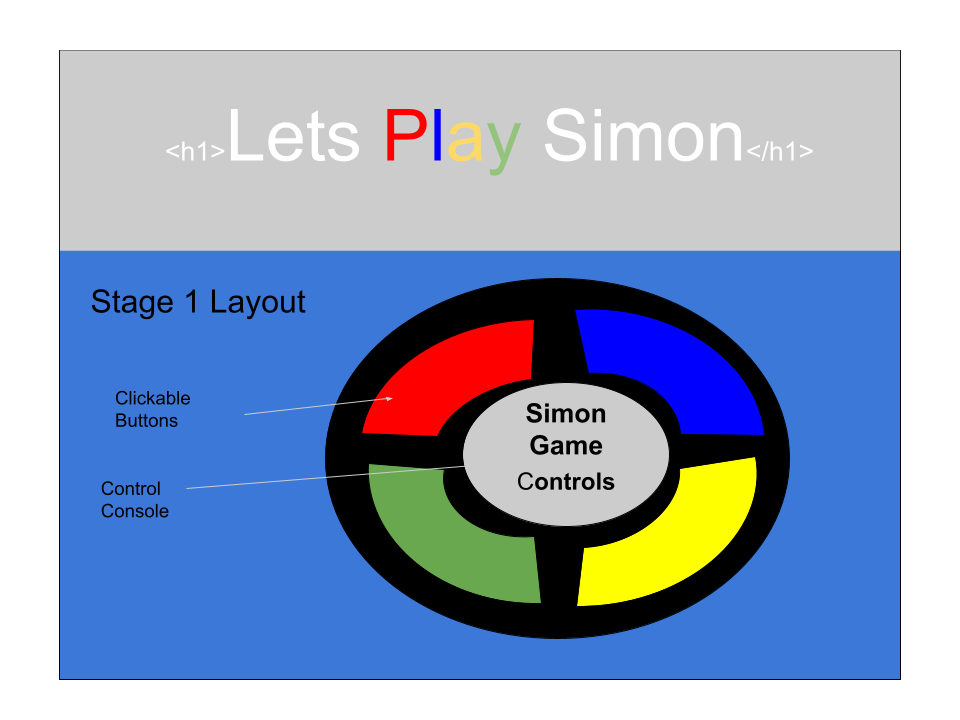
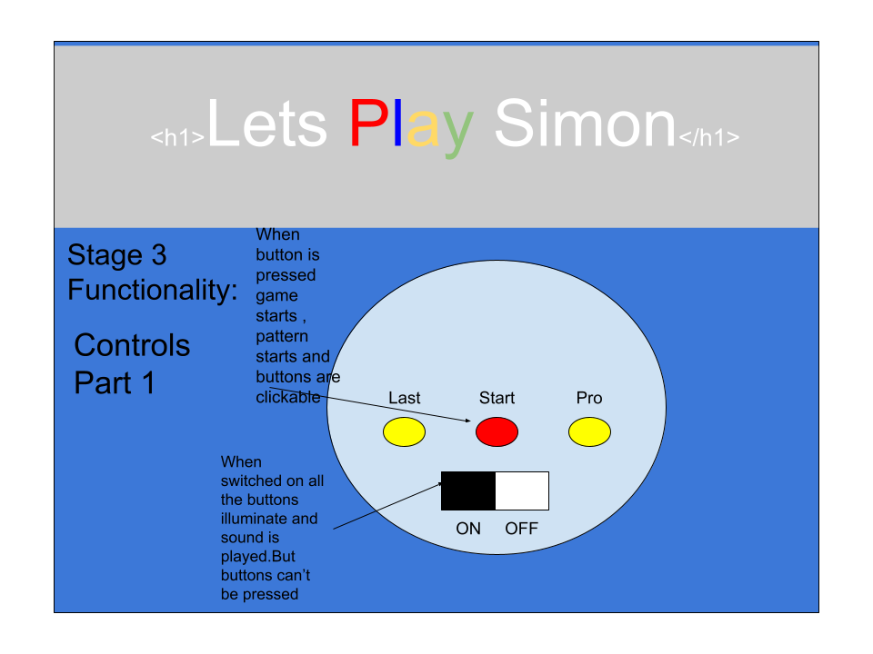
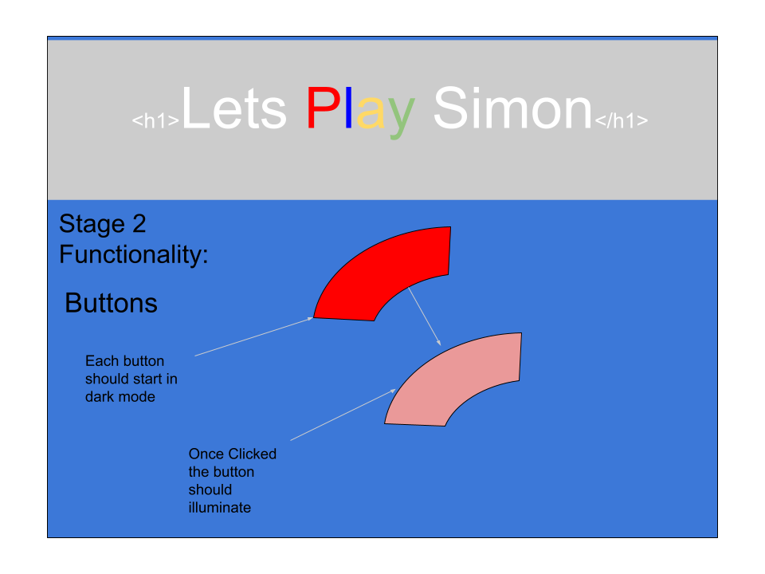
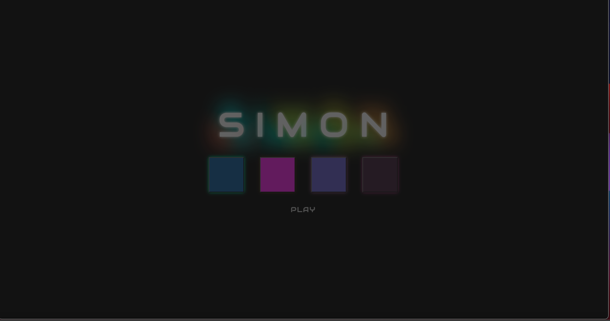
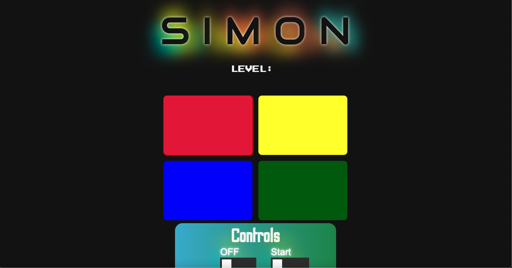
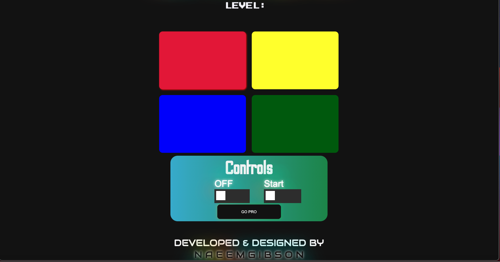

# Project 1

## Simon Game

--------

## Game Details 
I created a virtual replication of the electronic toy game Simon. A user is presented a light/sound pattern corresponding to four different color buttons. The user must perfectly mimic the pattern presented to complete the level. If the wrong button is pressed in regular mode the user gets an opportunity to repeat the level. In pro mode, the user must complete each level in one try or they are sent to the beginning of the game. The game ends at level 16.

--------

## User Stories
- As a player, I want to be informed when it is my turn to go in the game.
- As a player, I want to know when I have completed a level.
- As a player, I want to be informed when I have failed a level.
- As a player, I want to know when I've beaten the game.
- As a player, I want know when the game is on.

--------

# Technologies Used
- HTML
- CSS
- ES6

--------
 
# Wireframes

--------

# SIMON Screenshots

--------

## Timeframes

| Task | Priority | Estimated Time | Time Invested | Actual Time |
| --- | :---: |  :---: | :---: | :---: |
| Setting up site framework | H | 1 hrs| 2 hrs | 3 hrs |
| Creating game logic | H | 20 hrs| 30 hrs |  35 hrs  |
| Styling| M | 5 hrs|   10 hrs|  8 hrs |
| Responsive Styling | L | 1 hrs| 5 hrs |  5 hrs  |
| Total | X | 31  hrs |  33 hrs  |  51 hrs|

--------

## Project Schedule

- See Trello [**TrelloLink](https://trello.com/b/Znr0RX4M/simon-game)

--------

# Hardships

- Mapping a timeframe and sticking to it.
- Fixing game logic
- Thinking responsive from the beginning
- Simple development first and adding complexity later
- Version control and committing 

--------

### Project Link

 [**ProjectLink](https://git.generalassemb.ly/SEI-712/project-1/issues/new?assignees=&labels=&template=proposal.md&title=Your+Name+-+Your+Squad+Lead) 

--------

# Resources
[**Link]()

 

## Project Week Format

- Projects must be submitted to the [gallery (via an issue)](https://git.generalassemb.ly/sei-712/project1-gallery/issues/new?assignees=&labels=&template=project-submission.md&title=YOUR+FULL+NAME) by Thursday 8/5 at 9:00 am ET.

  

  

